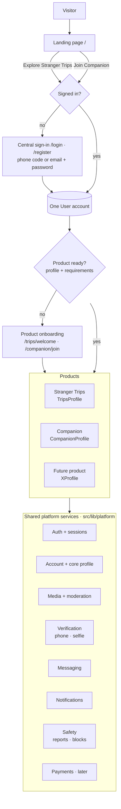
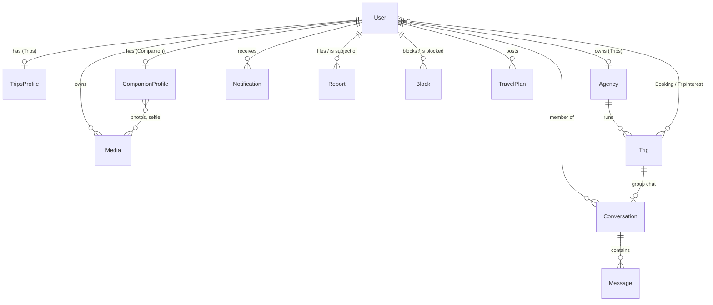
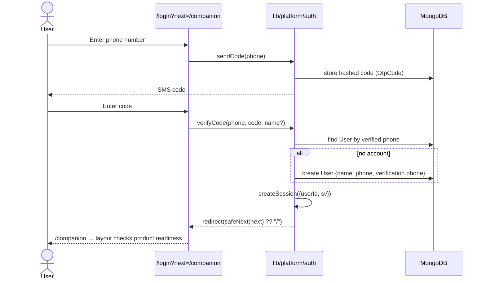
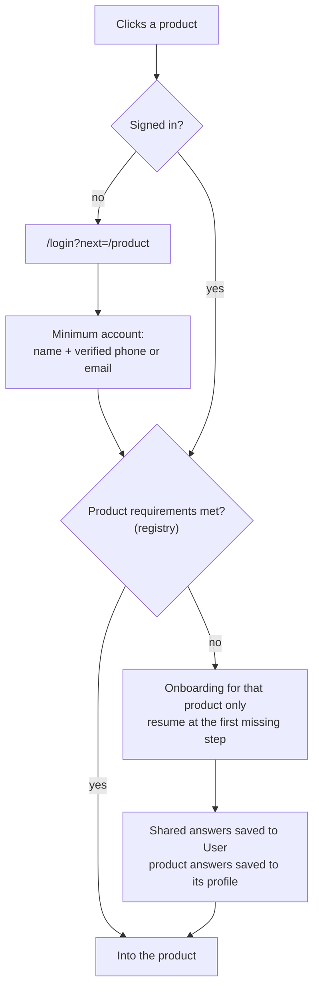

# Platform Architecture: One Account, Many Products

The target design for running Stranger Trips, Companion and any future product on one
identity system, and the steps to get there from today's code. For how the app works
right now, see [ARCHITECTURE.md](ARCHITECTURE.md).

> Written 30 Sep 2026 against Next.js 16.3, Mongoose 9. Status of each part is marked
> **Done**, **Partial** or **To do**.

## Contents

1. [Where we are today](#1-where-we-are-today)
2. [Principles](#2-principles)
3. [High-level architecture](#3-high-level-architecture)
4. [Database and schema relationships](#4-database-and-schema-relationships)
5. [Authentication flow](#5-authentication-flow)
6. [Onboarding flow](#6-onboarding-flow)
7. [Route structure and navigation](#7-route-structure-and-navigation)
8. [Middleware and authorization strategy](#8-middleware-and-authorization-strategy)
9. [Folder structure](#9-folder-structure)
10. [API structure](#10-api-structure)
11. [Adding a future product](#11-adding-a-future-product)
12. [Extracting auth into its own service](#12-extracting-auth-into-its-own-service)
13. [Migration plan](#13-migration-plan)

---

## 1. Where we are today

The foundation is already right: there is **one `users` collection and one session
cookie**, and Companion keeps its own data in a separate `CompanionProfile` keyed by user.
The gaps are in *how people sign in* and in *which data lives where*.

| Area | Status | Today |
|---|---|---|
| One user record per person | **Done** | `User` (`src/lib/db/models/user.ts`) is shared; `platforms: ["trips","companion"]` records what they joined. |
| One session | **Done** | Signed JWT cookie (`src/lib/auth/session.ts`), read only by the DAL (`src/lib/auth/dal.ts`). |
| Companion profile separate from user | **Done** | `CompanionProfile` with `user` (unique). |
| Shared notifications | **Done** | `Notification` + `notify()` are product-agnostic. |
| **One sign-in page** | **Done** | `/login` and `/register` offer phone code or email + password and honour `?next=`. `src/proxy.ts` sends signed-out visitors of `/trips`, `/companion` and other private areas there. Companion no longer signs people in; it only adds a verified phone to the signed-in account. |
| **Trips profile separate from user** | **To do** | Trip-only fields sit on `User`: `personality`, `bio`, `emergencyContact`, `birthYear`, and a `gender` enum from `trips/constants`. |
| **Core fields in one place** | **To do** | Date of birth, gender and city exist on both `User` (`birthYear`, `gender`, `city`) and `CompanionProfile` (`birthDate`, `gender`, `location.city`), with different formats and enums. |
| Shared photos + moderation | **To do** | `CompanionImage`, `moderation.ts`, `face-match.ts` and `verification.ts` live under Companion. |
| Shared chat | **To do** | `Message` requires a `trip`; there are no direct conversations. |
| Shared reports | **Partial** | `Report` works for any user but only has an optional `trip` for context. |
| Blocking | **To do** | Doesn't exist. |
| Platform nav | **Partial** | Marketing nav links both products and knows if you're signed in; there are no Messages or Settings pages yet. |

---

## 2. Principles

1. **Authentication answers "who is this?"** One place: `lib/platform/auth`. Products
   never read cookies, hash passwords or send codes themselves.
2. **Authorization answers "what may they do?"** Checked on the server in every page,
   layout and action, through the DAL helpers (§8).
3. **Product profiles answer "what do they want here?"** One profile collection per
   product, keyed by `user`. Never a second user collection.
4. **Platform code never imports product code.** Products depend on the platform, not the
   other way round. The one exception is the product registry, which only holds metadata.
5. **A field lives where it's true everywhere.** If Trips and Companion both need date of
   birth, it's on `User`. If only Trips cares about an emergency contact, it's on
   `TripsProfile`.

---

## 3. High-level architecture



Everything runs in **one Next.js app and one MongoDB database**. The split is by module
boundary, not by deployment, which keeps it simple now and makes it possible to pull
pieces out later (§12).

---

## 4. Database and schema relationships



### 4.1 `User`: identity and facts true on every product

| Field | Notes | Change |
|---|---|---|
| `name`, `email`, `passwordHash`, `phone` | Sign-in identifiers. Email and phone each unique when set. | keep |
| `verification { email, phone, identity }` | Platform-wide. Identity set by the selfie check. | keep |
| `role` | **Platform** role only: `user` \| `admin` (see §8.3 for `agency`). | later |
| `status` | `active` \| `suspended`. Suspension applies everywhere. | keep |
| `birthDate` | Replaces `birthYear` and `CompanionProfile.birthDate`. | **new** |
| `gender` | One platform enum; products may show a subset. | **merge** |
| `location { city, point }` | Replaces `city` and `CompanionProfile.location`. | **merge** |
| `avatar` | Ref to `Media`: the main photo shown everywhere. | **new** |
| `platforms` | Products they've *started*. Whether they've *finished* comes from the product profile's `status`. | keep |
| `sessionVersion` | Bump to sign someone out everywhere (§5.4). | **new** |

**Interests are *not* on `User`.** Travel personality tags and Companion hobbies are
different lists with different meanings, so each lives on its product profile. If a
shared interest list appears later, add `User.interests` then.

### 4.2 Product profiles

| Collection | Fields |
|---|---|
| **`TripsProfile`** (new) | `user` (unique), `status` (`draft`/`active`), `personality[]`, `bio`, `emergencyContact { name, phone }`, travel preferences (budget range, preferred destinations), `completedAt` |
| **`CompanionProfile`** (exists) | Keeps `heightCm`, `bodyType`, `sexuality`, `hobbies`, `drinking`, `smoking`, `photos`, `selfie`, `status`. **Drops** `birthDate`, `gender`, `location` (moved to `User`). **Adds** `availability`, `preferredAreas`. |
| **`Agency`** (exists) | Unchanged. Trips-specific business account owned by a user. |

### 4.3 Shared-service collections

| Collection | Fields | From |
|---|---|---|
| **`Media`** | `owner`, `kind` (`photo`/`selfie`/`chat`), `product?`, `contentType`, `bytes`, `data` (later a storage key for S3/R2), `moderation { status, reason, checkedAt }` | rename of `CompanionImage` |
| **`Conversation`** | `kind` (`group`/`direct`), `product`, `subject { type: "trip", id }?`, `members[]`, `lastMessageAt` | new |
| **`Message`** | `conversation`, `user?`, `kind` (`text`/`system`), `body` | today's `Message`, with `trip` → `conversation` |
| **`Report`** | `reporter`, `reported`, `product`, `context { type, id }?`, `reason`, `details`, `status` | today's `Report`, with `trip` → `context` |
| **`Block`** | `blocker`, `blocked`, unique pair | new |
| **`Notification`**, **`OtpCode`** | unchanged | exist |

Product data (`Trip`, `Booking`, `TripInterest`, `TravelPlan`, `BuddyRequest`) stays as it
is and keeps referencing `User`.

---

## 5. Authentication flow

### 5.1 Sign-in methods

Both methods live on the central `/login` and `/register` pages and end in the same
`createSession()`.

| Method | Used by | Code today → target |
|---|---|---|
| Phone + one-time code | Everyone; the default on mobile | `lib/companion/otp.ts`, `sms.ts`, `verifyCode()` → `lib/platform/auth/otp.ts`, `phone.ts` |
| Email + password | Existing accounts, agencies, admins | `lib/auth/actions.ts` → `lib/platform/auth/password.ts` |



### 5.2 Account linking

One person, one account, even with both an email and a phone:

- **Signed in, adds a phone** (Settings → Phone): verify the code, attach it to the current
  account. Refuse if another account already has that verified number. This is today's
  `viewer` branch of `verifyCode()`.
- **Signed in, adds an email**: send a verification link, then set `verification.email`.
- **Signed out, enters a phone that already has an account**: sign in to that account.
  Never create a second one.

### 5.3 After sign-in

`redirect(safeNext(next) ?? homeFor(user))`. `homeFor` sends admins to `/admin` and
agency owners to `/agency`; everyone else goes to their last-used product, or `/` if they
have none. Today everyone else goes to `/trips`.

### 5.4 Sessions

- Keep the signed JWT cookie (`session`, httpOnly, sameSite=lax, 7 days).
- Payload: `{ userId, sv }`. Drop `role` from it; the DAL already reloads the user.
- **`sv` = `User.sessionVersion`.** The DAL rejects cookies with an old `sv`, so
  "sign out everywhere", password changes and suspensions revoke every device.

---

## 6. Onboarding flow

Ask only for what the chosen product needs, and ask for it once.



Each product declares its requirements in the registry (§11):

| Product | Needs before entering | Needs before specific actions |
|---|---|---|
| Stranger Trips | Account | Book a trip: phone, date of birth, emergency contact (today's `bookTrip()` check) |
| Companion | Verified phone, date of birth, 3+ photos, **verified selfie**, profile complete | — |

A shared answer (date of birth, gender, city, photo) entered in one product is pre-filled
and skipped in the next. Companion's join flow already resumes at the first missing step
(`resumeStep()` in `lib/companion/types.ts`). The change is that its first two slides
(name, phone code) move to the central sign-in.

---

## 7. Route structure and navigation

| Route | Purpose | Access |
|---|---|---|
| `/` | Landing page | public |
| `/explore` | Browse both products (to do) | public |
| `/about`, `/terms`, `/privacy` | Static pages (to do) | public |
| `/login`, `/register` | Central sign-in: phone code or email | signed out |
| `/register/agency` | Agency sign-up (Trips business account) | signed out |
| `/account` | Core profile: name, photo, DOB, gender, city | signed in |
| `/settings` | Phone, email, password, sessions, blocked users, delete account | signed in |
| `/messages`, `/messages/[id]` | All conversations across products | signed in |
| `/notifications` | Exists | signed in |
| `/trips/…` | Stranger Trips (exists); `/trips/welcome` = onboarding | public browse; actions need sign-in |
| `/companion/…` | Companion (exists); `/companion/join` = onboarding | ready users only |
| `/agency/…` | Agency console | agency owner |
| `/admin/…` | Platform admin, across all products | admin |

**Navbar.** Built from `siteConfig` plus the product registry, so a new product appears
automatically.

- Signed out: Logo · Explore · Stranger Trips · Companion · About · **Log in** · **Sign up**
- Signed in: Logo · Stranger Trips · Companion · Messages · Notifications (bell) · avatar
  menu → Profile, Settings, Log out

Each product keeps its own sub-nav (today's `TripsNav` bottom bar), shown under the
platform header.

---

## 8. Middleware and authorization strategy

### 8.1 Three layers

| Layer | Where | Does | Trust |
|---|---|---|---|
| **Proxy** (optional) | `src/proxy.ts` (Next 16's name for middleware) | If there's no `session` cookie on `/account`, `/settings`, `/messages`, `/companion`, `/agency` or `/admin`, redirect to `/login?next=…`. No database calls. | Optimistic only. Next's docs say not to rely on it for authorization. |
| **DAL** | `lib/platform/auth/dal.ts` | Verifies the cookie, loads the user, checks status and `sessionVersion`. | The real check. |
| **Guards** | layouts, pages **and** every action | `requireUser()`, `requireProduct("companion")`, `requireRole("admin")`, ownership checks. | Real. Actions re-check because they can be called without rendering the layout. |

### 8.2 Guard helpers

```ts
getCurrentUser()                       // { id, name, role, … } | null   (exists)
requireUser(next?)                     // redirect to /login?next=        (exists)
requireRole("admin")                   // 404 for others                  (exists)
requireProduct("companion", next?)     // signed in + requirements met, else
                                       //   /login?next= or the product's onboarding (new)
```

`requireProduct` replaces the ad-hoc `companionUser()` in `lib/companion/actions.ts` and
the redirect logic in `app/companion/join/page.tsx`.

### 8.3 Roles vs product permissions

- **Platform roles** on `User.role`: `user`, `admin` (later `support`). Admins see every
  product.
- **Product permissions** come from product data, not the role. *Agency owner* means
  "owns an `Agency`". *Trip group member* means "has a confirmed `Booking`" (today's
  `groupAccess()`).
- Today `agency` is also a value of `User.role`. That works, but it's a Trips concept on a
  platform field. Moving it to "owns an approved Agency" is optional and can wait until
  a second product needs a business role.

### 8.4 Safety checks shared by every product

- **Blocks:** `isBlocked(a, b)` in `lib/platform/safety`. Every product's matching and
  listing queries and every messaging action exclude blocked pairs in both directions.
- **Suspension:** handled once in the DAL; every product inherits it.
- **Moderation:** every upload goes through `lib/platform/media` (`moderatePhoto()`),
  whichever product it's for.

---

## 9. Folder structure

The existing conventions stay (`queries.ts` for reads, `actions.ts` for `"use server"`
writes, DTOs out). Product folders stay where they are to limit churn. Shared code moves
under `lib/platform/`.

```
src/
├── proxy.ts                         optimistic redirects (§8.1)
├── app/
│   ├── (marketing)/                 /, /explore, /about, /terms, /privacy
│   ├── (auth)/                      /login, /register, /register/agency
│   ├── (platform)/                  shared signed-in pages, one layout with platform header
│   │   ├── account/                 /account
│   │   ├── settings/                /settings
│   │   ├── messages/                /messages, /messages/[id]
│   │   └── notifications/           /notifications (moved in)
│   ├── trips/                       Stranger Trips (+ welcome/ onboarding)
│   ├── companion/                   Companion (join/ onboarding)
│   ├── agency/  admin/
│   └── api/
│       ├── media/[id]/route.ts      was api/companion/images/[id]
│       ├── conversations/[id]/messages/route.ts   was api/trips/[id]/messages
│       └── v1/…                     only when a mobile/external client exists (§10)
├── components/
│   ├── ui/  layout/  auth/          shared
│   ├── platform/                    account, settings, messages, photo uploader
│   ├── trips/  companion/  agency/  admin/  home/
└── lib/
    ├── platform/                    SHARED SERVICES, product-agnostic
    │   ├── auth/                    session.ts, dal.ts, password.ts, otp.ts, sms.ts, actions.ts
    │   ├── account/                 queries.ts, actions.ts (core profile)
    │   ├── media/                   images.ts, moderation.ts, face-match.ts
    │   ├── verification/            selfie.ts (was companion/verification.ts), actions.ts
    │   ├── messaging/               queries.ts, actions.ts
    │   ├── notifications/           notify(), read functions (moved in)
    │   ├── safety/                  reports.ts, blocks.ts
    │   └── products.ts              product registry (§11)
    ├── trips/  agency/  companion/  admin/     PRODUCTS, import from platform/
    └── db/models/
        ├── user.ts  media.ts  conversation.ts  message.ts  notification.ts
        ├── report.ts  block.ts  otp-code.ts                     platform
        ├── trips-profile.ts  agency.ts  trip.ts  booking.ts  …  trips
        └── companion-profile.ts                                 companion
```

Enforce principle 4 with ESLint `no-restricted-imports`: files in `src/lib/platform/**`
may not import `@/lib/trips/*`, `@/lib/companion/*` or `@/lib/agency/*`.

---

## 10. API structure

**The web UI keeps using Server Components for reads and Server Actions for writes**, as
today. Route handlers exist only where something outside a React render needs JSON:
polling chat, serving images, and later a mobile app.

Server Actions, grouped by module:

| Module | Actions |
|---|---|
| `platform/auth` | `sendCode`, `verifyCode`, `loginWithPassword`, `register`, `logout`, `logoutEverywhere` |
| `platform/account` | `updateCoreProfile`, `addEmail`, `changePassword`, `deleteAccount` |
| `platform/media` | `uploadPhoto`, `removePhoto`, `reorderPhotos` |
| `platform/verification` | `submitSelfie`, `getSelfieStatus` |
| `platform/messaging` | `startConversation`, `sendMessage`, `markRead` |
| `platform/safety` | `reportUser`, `blockUser`, `unblockUser` |
| `trips` / `companion` | product actions as today (`bookTrip`, `saveInterests`, …) |

When a mobile app arrives, add a thin versioned REST layer that calls **the same `lib`
functions**, authenticated with a bearer token instead of the cookie:

```
POST   /api/v1/auth/otp            POST /api/v1/auth/otp/verify     POST /api/v1/auth/logout
GET    /api/v1/me                  PATCH /api/v1/me
GET    /api/v1/me/profiles/:product          PUT /api/v1/me/profiles/:product
POST   /api/v1/media               DELETE /api/v1/media/:id
GET    /api/v1/conversations       GET/POST /api/v1/conversations/:id/messages
POST   /api/v1/reports             POST/DELETE /api/v1/blocks/:userId
/api/v1/trips/…                    /api/v1/companion/…
```

---

## 11. Adding a future product

The registry in `src/lib/platform/products.ts` is the single list of products:

```ts
export const PRODUCTS = {
  trips: {
    name: "Stranger Trips",
    basePath: "/trips",
    onboardingPath: "/trips/welcome",
    requirements: [],                                  // browse freely
  },
  companion: {
    name: "Companion",
    basePath: "/companion",
    onboardingPath: "/companion/join",
    requirements: ["phoneVerified", "birthDate", "identityVerified", "profileActive"],
  },
} as const satisfies Record<string, ProductDefinition>;

export type ProductId = keyof typeof PRODUCTS;
```

`requireProduct()`, the navbar, `User.platforms`, `Report.product` and
`Conversation.product` all read from it.

**Checklist for a new product (e.g. Events):**

1. Add `events` to `PRODUCTS` with its requirements.
2. Add `EventsProfile` (`user` unique, `status`, product fields) in `lib/db/models/`.
3. Create `app/events/` with a layout that calls `requireProduct("events")`, and
   `app/events/join/` for onboarding.
4. Put logic in `lib/events/`, reusing platform services for photos, chat, reports,
   blocks and notifications.
5. Nothing changes in auth, sessions, the `User` model or other products.

---

## 12. Extracting auth into its own service

Because every product goes through the `lib/platform/auth` interface
(`getCurrentUser`, `requireUser`, `createSession`, `sendCode`/`verifyCode`, password
sign-in), the internals can be swapped without touching products:

1. **Now:** in-process functions, JWT cookie, users in the app's MongoDB.
2. **When needed:** stand up an auth service (your own, or an OIDC provider such as
   Auth0, Clerk or Keycloak) that owns credentials, OTP and sessions. Add `User.authId`
   (the provider's subject ID). `dal.ts` verifies the provider's token and maps `authId`
   to the local `User`.
3. Profiles, products and shared services keep using the local `User._id`; only
   `lib/platform/auth` changes.

Prepare now by never reading `passwordHash`, `OtpCode` or the cookie outside
`lib/platform/auth`.

---

## 13. Migration plan

Each phase ships on its own and leaves the app working.

### Phase 1: Central sign-in (highest value, low risk) · Done 30 Sep 2026

Shipped with shared code in `src/lib/auth/` (not yet moved under `lib/platform/`).
Still open from this phase: a single `requireProduct()` helper (Companion's readiness
checks still live in its pages).


- Move `otp.ts`, `sms.ts` and phone sign-in from `lib/companion/` to `lib/platform/auth/`.
- `/login` and `/register` offer **phone code** (default) and **email + password**.
- Companion's join flow starts after sign-in: drop its name/phone slides, and have
  `/companion/join` redirect signed-out visitors to `/login?next=/companion/join`.
  Companion requires a verified phone, so a signed-in email user adds one there.
- Add `requireProduct()`; replace `companionUser()`.
- Navbar: add Companion; signed-in avatar menu.

### Phase 2: Split profiles

- Add `TripsProfile`; move `personality`, `bio`, `emergencyContact` into it.
- Add `User.birthDate` and `User.location`; unify `gender`. Point Companion's slides and
  Trips' profile form at them.
- One-off `scripts/migrate-profiles.ts`: copy fields, derive `birthDate` from
  Companion's date or 1 July of `birthYear`, then unset the old fields. Safe to re-run.
- Update `getCurrentUser()` (drop `personality`), matching, trust score and admin pages
  to read from the new places.

### Phase 3: Shared services

- `CompanionImage` → `Media` (collection rename + `moderation` field). Move
  `moderation.ts`, `face-match.ts` and `verification.ts` to `lib/platform/`.
- `Conversation` + `Message.conversation`; migrate each trip's messages into a group
  conversation. Add `/messages` and direct conversations (Companion chats).
- `Report.product` + `context`; add `Block` and apply it in listings and messaging.
- `/account` and `/settings` pages.

### Phase 4: Scale-out readiness

- Product registry drives nav and guards; `src/proxy.ts` for optimistic redirects.
- `sessionVersion` and "sign out everywhere".
- Lint rule enforcing platform ↛ product imports.
- `/api/v1` only when a mobile client is planned.
